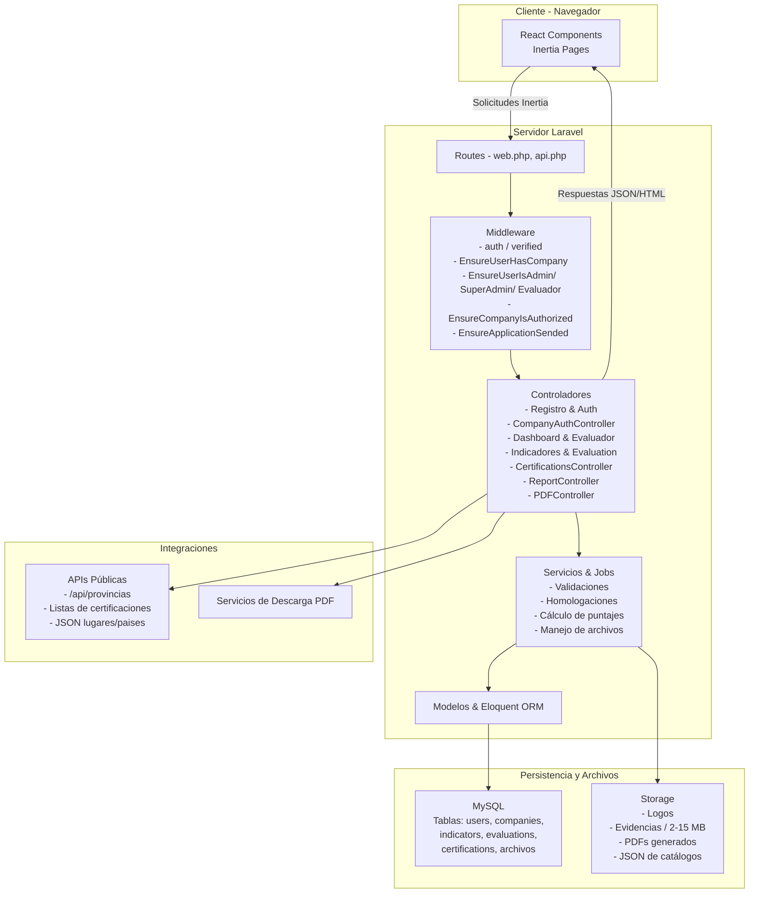

# Diagrama de Infraestructura del Sistema de Licenciamiento ESCR

Este documento resume la arquitectura de software del sistema y muestra cómo se relacionan los módulos descritos en la documentación funcional con los componentes técnicos de Laravel, Inertia y React.

## Visión General
- **Frontend**: React + Inertia.js gestionan formularios complejos (registro, formulario de empresa, autoevaluación, evaluación) y paneles para cada rol.
- **Backend**: Laravel expone controladores modulares (registro, gestión de empresas, indicadores, evaluaciones, certificaciones, reportes, etc.) protegidos por middleware especializados.
- **Persistencia**: MySQL (migraciones + `db_limpia.sql`) almacena usuarios, empresas, indicadores, evaluaciones, certificaciones y adjuntos. Archivos viven en `storage/app/public` con enlaces simbólicos a `public/storage`.
- **Servicios complementarios**: API Sanctum (`/api/user`, `/api/users/company`, `/api/provincias`) para operaciones asincrónicas usadas por Inertia, y generación de PDFs desde el backend (`PDFController`).

## Diagrama (Mermaid)


```flowchart LR
 subgraph subGraph0["Cliente - Navegador"]
        A["React Components<br>Inertia Pages"]
  end
 subgraph subGraph1["Servidor Laravel"]
        B["Routes - web.php, api.php"]
        C["Middleware
- auth / verified
- EnsureUserHasCompany
- EnsureUserIsAdmin/ SuperAdmin/ Evaluador
- EnsureCompanyIsAuthorized
- EnsureApplicationSended"]
        D["Controladores
- Registro & Auth
- CompanyAuthController
- Dashboard & Evaluador
- Indicadores & Evaluation
- CertificationsController
- ReportController
- PDFController"]
        E["Servicios & Jobs
- Validaciones
- Homologaciones
- Cálculo de puntajes
- Manejo de archivos"]
        F["Modelos & Eloquent ORM"]
  end
 subgraph subGraph2["Persistencia y Archivos"]
        G["MySQL
Tablas: users, companies,
indicators, evaluations,
certifications, archivos"]
        H["Storage
- Logos
- Evidencias / 2-15 MB
- PDFs generados
- JSON de ubicaciones geograficas (Provincias, Cantones y Distritos)"]
  end
 subgraph Integraciones["Integraciones"]
    direction TB
        J["Servicios de Descarga PDF"]
  end
    A -- Solicitudes Inertia --> B
    B --> C
    C --> D
    D --> E
    E --> F & H
    F --> G
    D -- Respuestas JSON/HTML --> A
    D -- Solicita generación PDF --> J
```

## Detalle por Módulo Funcional

| Módulo | Flujo principal | Componentes claves |
|--------|-----------------|--------------------|
| **Registro** | Captura datos de usuario, valida cédula jurídica y asigna empresa. | Rutas `register`, controladores de registro + `CompanyAuthController`, middleware `auth`, validaciones descritas en `docs/registro.md`. |
| **Formulario de Empresa** | Captura información corporativa, logos, productos, certificaciones previas. | Componentes React con manejadores `handleChange`, `uploadLogo`, etc. (`docs/formulario-empresa.md`), almacenamiento en `storage/app/public`. |
| **Autoevaluación** | Empresa responde indicadores agrupados por valores, con homologación por certificaciones. | Controladores `IndicadoresController`, procesos descritos en `docs/auto-evaluacion.md`, guardado parcial y final. |
| **Evaluación** | Evaluador responde preguntas derivadas de indicadores aprobados, adjunta evidencias. | `EvaluationController`, flujos de archivos (2MB/archivo, 15MB/pregunta) y homologaciones (`docs/evaluacion.md`). |
| **Certificaciones** | Gestión CRUD de certificaciones homologables. | `CertificationsController` (rutas `certifications.*`), middleware de empresa (`docs/certificaciones.md`). |
| **Super Admin** | Dashboard global, gestión de usuarios/empresas, reportes. | `SuperAdminController`, `UsersManagementSuperAdminController`, `CompanyManagementController`, `ReportController`, rutas `/super/*`. |
| **Evaluador** | Cambia empresa activa, revisa indicadores y evaluaciones. | `EvaluadorController`, APIs `/api/evaluador/*`. |
| **Reportes/PDF** | Generación y descarga de PDFs, exportación autorizada. | `PDFController`, `ReportController`, almacenamiento en `storage/app/public/pdfs`. |

## Flujo de Datos Clave
1. **Autenticación y Autorización**: Laravel Sanctum protege APIs, mientras middleware garantiza que cada rol acceda sólo a sus rutas (`EnsureUserIsSuperAdmin`, `EnsureCompanyIsAuthorized`, etc.).
2. **Sincronización Front-Back**: Inertia renderiza páginas React con datos entregados por controladores; las acciones POST/PUT/DELETE invocan endpoints web/API y devuelven redirecciones o props actualizadas.
3. **Manejo de Archivos**: Evidencias, logos y PDFs se guardan en storage; `php artisan storage:link` los expone vía `public/storage`. Requiere copiar `paises.json` y `lugares.json` a storage para catálogos.
4. **Evaluaciones**: Autoevaluación guarda respuestas periódicamente, identifica indicadores descalificatorios y calcula puntajes; la evaluación formal se habilita sólo si la autoevaluación finalizó y la empresa cumple requisitos (exportadora/autorizada).

## Despliegue
- **Local**: `php artisan serve` + `npm run dev` para hot-reload de React.
- **Producción**: `npm run build`, `php artisan optimize` y configuración de cache. PDFs y adjuntos deben estar en `storage/app/public/pdfs` y `storage/app/public` respectivamente.
- **Base de Datos**: Inicializar con `db_limpia.sql` y mantener migraciones al día (`php artisan migrate`).

Este diagrama permite entender cómo los módulos documentados interactúan dentro de la infraestructura de código y sirve como guía para nuevos desarrolladores.