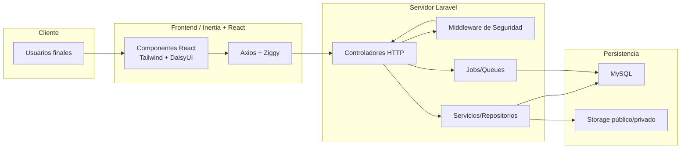

# Documentación Técnica Integral de la Plataforma de Licenciamiento ESCR

## 1. Propósito y Alcance
La plataforma digitaliza el proceso de licenciamiento esencial para empresas exportadoras de Costa Rica, ofreciendo registro, autoevaluación, evaluación por terceros y emisión de reportes para equipos administrativos, evaluadores y super administradores. Resume y amplía la información operativa solicitada por TI para generar el expediente institucional del proyecto, describiendo tecnologías, arquitectura, seguridad y manuales de uso.

## 2. Tecnologías, Paquetes y Entorno
| Capa | Tecnologías Clave | Uso Principal |
| --- | --- | --- |
| Backend | PHP 8.2, Laravel 11, Sanctum, Filament, Inertia Laravel, Barryvdh DOMPDF, PHPWord, Maatwebsite Excel, FPDF/FPDI | API REST + controladores web, autenticación basada en tokens/sesiones, generación de PDFs/Word y exportaciones, panel administrativo Filament. |
| Frontend | React 18, Inertia.js, Vite 5, TailwindCSS 3, DaisyUI, HeadlessUI, Axios, @dnd-kit, Heroicons/Lucide, React Datepicker | SPA híbrida conectada al router de Laravel, componentes responsivos, formularios y drag & drop para indicadores y catálogos. |
| DevOps | Composer, npm, Vite build/dev scripts, `concurrently` | Ejecución simultánea de servidor Laravel, colas, pail logs y compilación Vite en desarrollo. |
| Datos | MySQL (importación inicial `db_limpia.sql`), archivos JSON (`lugares.json`, `paises.json`), repositorio de PDFs (`storage/app/public/pdfs`) | Persistencia transaccional, catálogos territoriales, repositorio documental adjunto. |
| QA | PHPUnit 11, Laravel Pint, Faker, Collision | Pruebas unitarias, formato de código y depuración interactiva. |

*Fuente:* definición de dependencias en `composer.json` y `package.json`, además de los prerrequisitos de instalación descritos en `README.md`.【F:composer.json†L7-L82】【F:package.json†L1-L33】【F:README.md†L5-L55】

### Requerimientos de Infraestructura
- PHP 8.2+, Composer y extensiones compatibles con Laravel 11.
- Node 18+ (recomendado) para construir el frontend con Vite.
- Servidor MySQL configurado con la base `db_limpia.sql` y migraciones vigentes.
- Acceso a almacenamiento local para enlazar `storage/app/public`, alojar JSON y PDFs.
- Variables de entorno configuradas en `.env` (APP_KEY, credenciales de DB, drivers de mail, colas, etc.).【F:README.md†L19-L55】

## 3. Arquitectura Técnica

### Descripción
1. **Front-end Inertia**: React renderiza pantallas dinámicas (dashboard, autoevaluación, gestión super admin) mientras Ziggy provee rutas firmadas y Axios maneja solicitudes protegidas por Sanctum/cookies CSRF.
2. **Back-end Laravel**: Controladores definidos en `routes/web.php` orquestan módulos de autenticación, certificaciones, autoevaluaciones, evaluaciones, reportes y catálogos, cada uno detrás de middleware de rol y estado empresarial.【F:routes/web.php†L48-L200】
3. **Capa de Seguridad**: Middleware como `EnsureUserIsSuperAdmin`, `EnsureCompanyIsAuthorized`, `EnsureApplicationSended` y `EnsureUserIsEvaluador` validan rol, estado de empresa y envío previo antes de liberar vistas o APIs.【F:app/Http/Middleware/EnsureUserIsSuperAdmin.php†L10-L22】【F:app/Http/Middleware/EnsureCompanyIsAuthorized.php†L11-L35】【F:app/Http/Middleware/EnsureApplicationSended.php†L18-L41】
4. **Persistencia y Archivos**: Tablas transaccionales en MySQL y almacenamiento en `storage/app/public` para catálogos y PDFs sustentan indicadores, anexos y resultados. Los paquetes DOMPDF/FPDI/PHPWord generan expedientes descargables.【F:composer.json†L7-L20】

## 4. Módulos Funcionales
| Módulo | Ruta/Controlador | Resumen |
| --- | --- | --- |
| Registro y asociación de empresa | `/company-register`, `CompanyAuthController` | Los usuarios completan datos personales, verifican la cédula jurídica, registran empresas inexistentes o solicitan acceso a empresas registradas. El sistema valida formatos, unicidad, y asigna al solicitante como administrador al crear la empresa.【F:docs/registro.md†L5-L74】【F:routes/web.php†L56-L75】 |
| Dashboard y Autoevaluación | `/dashboard`, `/indicadores/{id}`, `DashboardController`, `IndicadoresController` | Presenta el progreso de cumplimiento y cuestionarios. Los indicadores permiten guardar respuestas parciales, finalizar autoevaluaciones y verificar estado antes de enviar la solicitud formal.【F:routes/web.php†L77-L146】 |
| Evaluación formal | `/evaluacion/{value_id}`, `EvaluationController` | Solo accesible si la empresa completó la autoevaluación y está autorizada; procesa envíos finales y manejo de archivos adjuntos para cada indicador.【F:routes/web.php†L148-L151】 |
| Panel Super Admin | `/super/*`, `SuperAdminController` y controladores auxiliares | Administra catálogos (valores, subcategorías, requisitos), usuarios, empresas, certificaciones, importaciones y fechas de expiración mediante vistas específicas y APIs REST internas.【F:routes/web.php†L174-L199】 |
| Panel Evaluador | `/evaluador/*`, `EvaluadorController` | Gestiona empresas asignadas, reportes y reevaluaciones, incluyendo cambiar de empresa activa y actualizar campos de evaluación.【F:routes/web.php†L153-L172】 |
| Reportes y Documentos | `ReportController`, `PDFController`, `MonthlyReportController` | Generación de reportes gerenciales, actas en PDF y listados mensuales apoyados en bibliotecas DOMPDF, Excel y Word. |

## 5. Requerimientos Funcionales y de Negocio
1. **Gestión de Registro**: Validaciones estrictas de campos de usuario y empresa, verificación de cédula jurídica y manejo de solicitudes pendientes.【F:docs/registro.md†L5-L74】
2. **Flujo de Autoevaluación → Evaluación**: Guardado parcial, envío final y verificación de `application_sended` antes de permitir formularios empresariales, evitando envíos duplicados una vez evaluados.【F:routes/web.php†L131-L151】【F:app/Http/Middleware/EnsureApplicationSended.php†L26-L41】
3. **Roles y permisos**: Cuatro roles (super_admin, admin, user, evaluador) definen qué vistas y APIs se muestran; el README resume las responsabilidades requeridas por el negocio.【F:README.md†L96-L167】
4. **Reportes Regulatorios**: Importación/exportación de catálogos, emisión de reportes PDF/Excel y registro de progresos para auditoría TI.
5. **Notificaciones y comunicación**: Envío de confirmaciones de registro, avisos de solicitud y flujos de aprobación descritos en el proceso de registro.【F:docs/registro.md†L75-L88】

## 6. Requerimientos No Funcionales y Estándares
- **Disponibilidad**: Separación de frontend/back-end permite escalar horizontalmente la capa de Laravel con balanceadores o colas según la carga de evaluaciones.
- **Usabilidad**: Componentes React + Tailwind garantizan formularios responsivos; DaisyUI y HeadlessUI aportan accesibilidad.
- **Interoperabilidad**: Exportación a PDF/Excel/Word y catálogos JSON facilita la entrega de expedientes regulatorios.
- **Mantenibilidad**: PSR-4 autoloading, colas Artisan y scripts de optimización (`php artisan optimize`, `php artisan optimize:clear`) simplifican despliegues repetibles.【F:composer.json†L32-L65】【F:README.md†L79-L95】

## 7. Seguridad y Niveles de Protección
1. **Autenticación y Sesiones**
   - Laravel Breeze/Sanctum brindan autenticación basada en sesiones/SPA con protección CSRF y revocación de tokens para APIs internas.【F:composer.json†L7-L30】
   - Password hashing administrado por Laravel (`bcrypt/argon`).
2. **Control de Accesos**
   - Middleware especializados bloquean accesos según rol, estado de empresa y pasos previos (super admin, evaluador, empresa autorizada, aplicación enviada).【F:app/Http/Middleware/EnsureUserIsSuperAdmin.php†L10-L22】【F:app/Http/Middleware/EnsureCompanyIsAuthorized.php†L11-L35】【F:app/Http/Middleware/EnsureApplicationSended.php†L18-L41】
   - Rutas agrupadas aseguran que cada módulo herede autenticación, verificación de email y asociación de empresa.【F:routes/web.php†L77-L200】
3. **Validaciones de Datos**
   - Proceso de registro impone sanitización, validación de formatos y restricciones para prevenir datos inconsistentes o inyecciones.【F:docs/registro.md†L5-L68】
4. **Protección de Flujos Críticos**
   - Acceso al formulario empresarial está condicionado al envío de autoevaluación y a que la empresa no esté ya evaluada, evitando reprocesos no autorizados.【F:app/Http/Middleware/EnsureApplicationSended.php†L26-L41】
   - Evaluadores solo interactúan con empresas autorizadas y asignadas; cualquier falla redirige con mensajes de error auditables.【F:app/Http/Middleware/EnsureCompanyIsAuthorized.php†L15-L32】
5. **Gestión Documental Segura**
   - Archivos se almacenan bajo `storage/app/public` detrás de enlaces simbólicos controlados (`php artisan storage:link`). Se recomienda restringir permisos en servidores productivos y firmar URLs temporales cuando se expongan a terceros.【F:README.md†L36-L54】
6. **Auditoría y Trazabilidad**
   - Uso de paquetes como Laravel Pail y logs del framework para monitorear eventos; notificaciones cubren aprobaciones/rechazos y errores en registros.【F:composer.json†L22-L31】【F:docs/registro.md†L75-L88】

## 8. Manuales y Procedimientos Operativos
### 8.1 Instalación y Configuración
- Instalar dependencias con `npm install` y `composer install`.
- Configurar `.env`, generar APP_KEY, ejecutar migraciones e importar la base histórica.
- Limpiar cachés, crear el enlace de storage y poblar catálogos JSON y PDFs requeridos.
- Iniciar servidores (`php artisan serve`, `npm run dev`) o construir artefactos (`npm run build`).【F:README.md†L11-L95】

### 8.2 Operación Diaria
1. **Autenticación**: Acceder con credenciales de super administrador por defecto (`admin@admin.com`/`password`) y actualizar inmediatamente en producción.【F:README.md†L71-L77】
2. **Gestión de Roles**: Utilizar el panel `/super/users` para asignar roles y estados siguiendo la tabla descrita en el README.【F:README.md†L96-L168】
3. **Registro de Empresas**: Seguir el flujo documentado en `docs/registro.md` para onboarding de nuevas organizaciones y verificación de cédulas.【F:docs/registro.md†L5-L74】
4. **Autoevaluación y Evaluación**: Supervisar dashboards, habilitar formularios de empresa sólo cuando `application_sended`=1 y la empresa esté autorizada. Evaluadores deben utilizar `/evaluador/dashboard` para calificar y, si es necesario, solicitar recalificaciones mediante `/api/evaluacion/calificar-nuevamente`.【F:routes/web.php†L131-L172】
5. **Reportes y Documentos**: Generar reportes desde `/super/reportes` y respaldar archivos producidos por DOMPDF/Excel para el expediente institucional.【F:routes/web.php†L174-L199】

### 8.3 Despliegue y Mantenimiento
- Construir assets (`npm run build`), limpiar y regenerar cachés antes de publicar (`php artisan optimize:clear` + `php artisan optimize`).
- Programar respaldos periódicos de la base MySQL y del almacenamiento `storage/app`.
- Monitorear colas y jobs (`php artisan queue:listen`) cuando se utilicen envíos asincrónicos según el script `composer dev`.【F:composer.json†L44-L65】【F:README.md†L79-L95】

## 9. Expediente y Referencias Cruzadas
| Documento | Contenido | Ubicación |
| --- | --- | --- |
| `README.md` | Guías de instalación, despliegue, roles y rutas esenciales. | Raíz del repositorio. |
| `docs/registro.md` | Detalle del flujo de registro, validaciones, seguridad y notificaciones. | `docs/` |
| `db_limpia.sql` | Estructura inicial de base de datos y datos semilla para licenciamiento. | Raíz. |
| `lugares.json` / `paises.json` | Catálogos requeridos para formularios y reportes. | Raíz (copiar a storage). |
| `storage/app/public/pdfs` | Plantillas institucionales (anexos, formatos oficiales). | Directorio de almacenamiento. |

Este documento complementa los archivos anteriores con la arquitectura, niveles de seguridad y manuales solicitados, permitiendo entregar a la Dirección de TI un expediente completo que incluya tecnologías empleadas, diagrama técnico y controles aplicados.