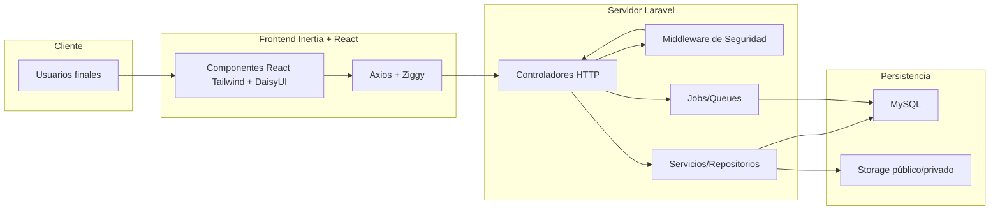

# Expediente Integral de la Plataforma de Licenciamiento ESCR

> Documento maestro que consolida todos los entregables solicitados por TI: tecnologías empleadas, arquitectura y diagrama técnico, requisitos y manuales de operación, así como la descripción funcional completa de registro, formulario empresarial, autoevaluación, evaluación y certificaciones. Incluye los estándares de seguridad y la trazabilidad necesaria para el expediente institucional.

## 1. Resumen Ejecutivo
- **Objetivo del sistema:** digitalizar el proceso de licenciamiento Marca País para empresas exportadoras, permitiendo registro, autoevaluación, evaluación formal, generación de reportes y emisión de certificados.
- **Actores principales:** usuarios solicitantes, administradores de empresa, evaluadores, super administradores y equipo TI.
- **Entregables clave:** plataforma web (Laravel + React), base de datos MySQL, almacenamiento documental, reportes PDF/Excel/Word, catálogos JSON y manuales operativos.

## 2. Tecnologías, Entorno y Dependencias
| Capa | Tecnologías/Paquetes | Uso | Referencia |
| --- | --- | --- | --- |
| Backend | PHP 8.2, Laravel 11, Sanctum/Breeze, Filament, Inertia Laravel, Barryvdh DOMPDF, PHPWord, Maatwebsite Excel, FPDF/FPDI | API REST + SSR, autenticación, panel administrativo, generación documental | `composer.json` |
| Frontend | React 18, Inertia.js, Vite 5, Tailwind CSS 3, DaisyUI, HeadlessUI, Axios, @dnd-kit, Heroicons/Lucide, React Datepicker | SPA híbrida, formularios responsivos, arrastrar/soltar | `package.json` |
| Datos | MySQL (`db_limpia.sql`), `lugares.json`, `paises.json`, `storage/app/public/pdfs` | Persistencia transaccional, catálogos geográficos, repositorio documental | `README.md` |
| DevOps | Composer, npm, Vite scripts, Laravel Artisan, `concurrently`, Laravel Pint, PHPUnit | Instalación, build, pruebas y formateo | `README.md`, `composer.json` |

**Requerimientos de infraestructura:** PHP 8.2+, Node 18+, MySQL configurado, variables en `.env`, enlace de `storage`, colas Artisan y acceso a catálogos JSON y PDFs institucionales.

## 3. Arquitectura Técnica y Diagrama

**Descripción resumida:**
1. **Front-end Inertia** renderiza pantallas dinámicas (dashboard, evaluaciones, paneles). Ziggy provee rutas firmadas y Axios maneja solicitudes protegidas (Sanctum/CSRF).
2. **Back-end Laravel** orquesta módulos mediante controladores en `routes/web.php`, apoyado por servicios y colas para generación de reportes y homologaciones.
3. **Seguridad por middleware** (`EnsureUserIsSuperAdmin`, `EnsureCompanyIsAuthorized`, `EnsureApplicationSended`, `EnsureUserIsEvaluador`) garantiza roles, estados y pasos previos antes de exponer vistas/APIs.
4. **Persistencia y archivos** en MySQL y `storage/app/public` para indicadores, anexos y reportes PDF/Word/Excel.

## 4. Módulos Funcionales
| Módulo | Flujo/Rutas principales | Resumen operativo |
| --- | --- | --- |
| Registro de usuario y empresa | `POST /register`, `POST /company-register`, verificación de cédula jurídica | Captura datos personales, valida formatos, comprueba unicidad de email/cédula y asigna administrador inicial |
| Formulario de empresa | `GET/POST /company/profile`, endpoints `upload-logo/fotos/certificaciones` | Administra datos corporativos, contactos, multimedia y campos adicionales para exportadores |
| Autoevaluación | `GET /indicadores/{id}`, `POST /indicadores/store-answers`, `POST /indicadores/finalizar-autoevaluacion` | Responde indicadores agrupados por valores, aplica homologaciones automáticas, calcula puntaje y bloquea edición tras finalizar |
| Evaluación formal | `GET /evaluacion/{value_id}`, `POST /evaluacion/store-answers`, `POST /evaluacion/enviar-evaluacion-calificada` | Desglosa preguntas por indicador aprobado, controla evidencias y calificaciones del evaluador |
| Certificaciones | `GET /certifications/create`, `POST /certifications`, `PUT/DELETE /certifications/{id}` | Gestiona certificaciones homologables, vigencias y archivos de evidencia |
| Paneles administrativos | `/dashboard`, `/evaluador/*`, `/super/*`, APIs asociadas | Visualiza progreso, administra catálogos, asigna roles y genera reportes oficiales |
| Reportes | Controladores `ReportController`, `PDFController`, `MonthlyReportController` | Exporta expedientes en PDF, Word y Excel para la Dirección de TI |

## 5. Proceso de Registro (Información consolidada)
### 5.1 Registro de Usuario
- Campos: nombre, apellido (solo letras), email válido, contraseña ≥8 caracteres, aceptación de términos.
- Validaciones: formato, unicidad de email, robustez de contraseña, confirmación de términos.
- Post-registro: creación en base, notificación de bienvenida, autenticación automática y redirección a verificación de cédula.

### 5.2 Verificación de Cédula Jurídica
- Entrada numérica (≤12 dígitos) validada en servidor.
- Resultados posibles: empresa existe (permite solicitar acceso) o no existe (redirige al formulario de empresa).

### 5.3 Flujo cuando la empresa existe
- Opciones: solicitar acceso (notifica a administrador, queda pendiente) o regresar.
- Estados: usuario marcado como pendiente hasta aprobación/rechazo.

### 5.4 Flujo cuando la empresa no existe
- Formulario de empresa con campos obligatorios (nombre, sitio web, sector, provincia, actividad, teléfonos, confirmación exportadora).
- Validaciones: formatos específicos, URL válidas, teléfonos numéricos.
- Resultado: creación de empresa, usuario administrador asignado, fecha de inicio de autoevaluación, redirección a dashboard.

### 5.5 Notificaciones y Seguridad
- Notificaciones: bienvenida, solicitud de acceso, avisos a administradores, aprobación/rechazo.
- Errores: logging, mensajes amigables, rollback de transacciones.
- Seguridad: sanitización de inputs, control de roles/permisos, middleware de autenticación, manejo de sesiones y limpieza periódica.

## 6. Formulario de Empresa
### 6.1 Funcionalidades Clave
- **Gestión de estado:** `handleChange`, `handleURLChange`, `handleAnioFundacionChange`, `handlePaisesChange`.
- **Validaciones:** `validarCampo`, `isValidEmail`, `obtenerLimitesEmpleados`.
- **Imágenes:** `handleImagenChange`, `uploadLogo`, `uploadFotografias`, `uploadCertificaciones`, `removeImagen`, `removeExistingImage`.
- **Productos:** `agregarProducto`, `handleDeleteProducto`, `eliminarProductoNuevo`, `confirmarEliminarProducto`.
- **UI y navegación:** `toggleSeccion`, `pasarSiguienteSeccion`, `openFinalizarModal`, `confirmFinalizarAutoevaluacion`.

### 6.2 Campos Requeridos
1. **Información general:** nombre comercial y legal, descripciones ES/EN, año fundación, sitio web, tamaño, cédula jurídica, actividad.
2. **Multimedia:** logo (≤1 MB, JPG/PNG), fotografías (1-3, ≤3 MB c/u), certificaciones opcionales (≤1 MB c/u).
3. **Licenciamiento:** razones ES/EN, proceso, recomendación de Marca País.
4. **Contactos obligatorios:** notificaciones, proceso de licenciamiento y representante legal (datos completos, teléfonos, correos, cédula donde aplique).
5. **Contactos opcionales:** mercadeo, micrositio, vocero.
6. **Exportadores:** países, productos, rango de exportaciones, planes de expansión.

### 6.3 Reglas y Restricciones
- Campos obligatorios marcados con *.
- Validaciones de formato: emails válidos, teléfonos numéricos, fecha DD/MM/AAAA.
- Capacidad de guardado parcial y bloqueo tras finalización de autoevaluación.
- Una vez enviada la autoevaluación, solo se habilita edición mediante intervención de evaluadores/super admin.

## 7. Proceso de Autoevaluación
### 7.1 Inicio
- Registra fecha de inicio para congelar catálogo de indicadores mostrado.
- Verifica certificaciones vigentes y marca indicadores homologados automáticamente con respuesta «Sí».

### 7.2 Evaluación de Indicadores
- Visualización agrupada por valores con marcadores de indicadores descalificatorios.
- Respuestas binarias (Sí/No) con justificación obligatoria para «Sí» y bloqueo de edición para homologados.
- Guardado automático cada 30 s.

### 7.3 Indicadores Descalificatorios
- Etiquetas visibles; una respuesta «No» descalifica automáticamente pero permite seguir respondiendo para completar expediente.

### 7.4 Cálculo de Puntaje
- Fórmula: `(Respuestas «Sí» + Indicadores Homologados) / Total de Indicadores * 100`.
- Condiciones: nota mínima por valor, todos los descalificatorios deben ser «Sí», homologaciones cuentan como «Sí».

### 7.5 Formulario Adicional y Documentación
- Información general, contactos, operaciones y anexos (logo, fotos, certificaciones, catálogo) deben completarse antes de finalizar.

### 7.6 Finalización del Proceso
1. Verificación de completitud y requisitos.
2. Cálculo de puntaje final.
3. Generación de reporte PDF.
4. Envío de notificaciones.
5. Bloqueo de edición.

### 7.7 Homologaciones
- Flujo: carga de certificaciones → verificación de vigencia → identificación de indicadores → asignación automática de respuestas.
- Características: respuesta/justificación automáticas, no editable, reversión al vencer certificación.

### 7.8 Rutas y Seguridad
- Rutas: `GET /indicadores/{id}`, `POST /indicadores/store-answers`, `POST /indicadores/save-partial-answers`, `POST /indicadores/finalizar-autoevaluacion`, `POST /company/profile` y endpoints de carga.
- Seguridad: autenticación, verificación de pertenencia a empresa, validaciones de formatos, fechas y tamaños de archivo.
- Notificaciones: guardado automático, alertas por certificación próxima a vencer, finalización, aprobaciones/rechazos.

## 8. Proceso de Evaluación Formal
### 8.1 Inicio
- Requisitos: autoevaluación completa, indicadores «Sí», formulario empresarial completo, empresa exportadora o autorizada.
- Filtrado: se muestran únicamente preguntas de indicadores aprobados y homologados a la fecha de registro.

### 8.2 Respuesta de Preguntas
- Tipos: binarias, descriptivas y homologadas.
- Requisitos: respuesta, descripción detallada, 1-3 evidencias (jpg/png/pdf/doc/xls, ≤2 MB c/u, ≤15 MB total) y justificación.
- Evidencias: compresión automática y almacenamiento seguro.

### 8.3 Homologaciones
- Proceso automático con certificaciones válidas, mapeo de indicadores y uso de evidencias existentes; bloquea edición mientras la certificación siga vigente.

### 8.4 Calificación por Evaluador
- Pasos: revisión, verificación de evidencias, calificación (Aprobado/No aprobado), comentarios.
- Criterios: pertinencia, calidad, cumplimiento, validez de homologaciones.

### 8.5 Puntaje y Estados
- Fórmula: `Puntaje = (Preguntas aprobadas / Total preguntas a responder) * 100`.
- Estados: `evaluacion` → `evaluacion-pendiente` → `evaluacion-completada` → `evaluado` → `evaluacion-calificada` o `evaluacion-desaprobada`.
- Transiciones: automáticas por progreso o manuales por evaluador, con notificaciones a empresa, evaluador y super admin.

### 8.6 Rutas y Seguridad
- Visualización: `GET /evaluacion/{value_id}`, `GET /api/evaluation/indicators`.
- Respuestas: `POST /evaluacion/store-answers`, `POST /evaluacion/store-answers-by-indicator`.
- Calificación: `POST /evaluacion/calificar-nuevamente`, `POST /evaluacion/enviar-evaluacion-calificada`.
- Panel evaluador: `/evaluador/dashboard`, `/evaluador/evaluations`, `POST /api/evaluador/switch-company`.
- Seguridad: validación de archivos, roles, control de estados, registro y trazabilidad de acciones, sanitización y respaldo de datos.

### 8.7 Reportes y Documentación
- PDF de evaluación con resumen ejecutivo, detalle por valor, evidencias y calificaciones.
- Estadísticas de progreso, puntajes, indicadores críticos y homologaciones para análisis.

## 9. Gestión de Certificaciones
### 9.1 Flujo General
1. Selección de certificación homologable (evita duplicados).
2. Registro de fechas de obtención (≤ fecha actual) y expiración (> obtención), organismo certificador obligatorio.
3. Carga de archivos (hasta 3, 5 MB c/u, 15 MB totales, formatos: jpg/jpeg/png/pdf/doc/docx/xls/xlsx) con vista previa y eliminación.
4. Validaciones de campos, formatos y tamaños antes de almacenar.
5. Procesamiento: validación, compresión de imágenes, almacenamiento, registro en base, cálculo de indicadores homologados y respuesta al usuario.

### 9.2 Operaciones sobre Certificaciones Existentes
- Lista ordenada con estado de expiración y evidencias.
- Edición de fechas, organismos y archivos (agregar/eliminar con límites).
- Eliminación mediante modal de confirmación, removiendo registros y archivos asociados.

### 9.3 Seguridad y Manejo de Errores
- Middleware `auth`, `verified`, `EnsureUserHasCompany`.
- Validación en tiempo real, mensajes específicos, rollback y limpieza de archivos ante errores.
- Sanitización de inputs y protección contra desbordamiento de archivos.

## 10. Seguridad y Estándares
1. **Autenticación y sesiones:** Laravel Breeze/Sanctum con protección CSRF, hashing seguro, revocación de tokens.
2. **Control de acceso:** middlewares especializados por rol y estado; rutas agrupadas con `auth`, `verified`, `EnsureUserHasCompany`, `EnsureCompanyIsAuthorized`, etc.
3. **Validación de datos:** sanitización server-side, formatos estrictos en registro/formulario/evaluaciones, verificación de fechas y tamaños.
4. **Protección de flujos críticos:** bloqueo de formularios empresariales sin autoevaluación enviada, restricciones para evaluadores solo sobre empresas autorizadas.
5. **Gestión documental segura:** almacenamiento en `storage/app/public`, enlaces simbólicos controlados, recomendación de permisos restringidos y URLs firmadas.
6. **Auditoría:** logging vía Laravel, Laravel Pail, notificaciones de eventos clave (registro, solicitudes, evaluaciones), respaldos periódicos de base y storage.

## 11. Manuales Operativos
### 11.1 Instalación y Configuración
1. Clonar repositorio y ejecutar `composer install` + `npm install`.
2. Configurar `.env`, generar `APP_KEY`, crear enlace `php artisan storage:link`.
3. Importar `db_limpia.sql`, ejecutar migraciones/seeders necesarios.
4. Ejecutar `npm run dev` y `php artisan serve` en desarrollo o `npm run build` + `php artisan optimize` en producción.

### 11.2 Operación Diaria
- Autenticarse con super administrador inicial (`admin@admin.com`/`password`) y cambiar credenciales inmediatamente.
- Administrar roles desde `/super/users`, revisar dashboard y estados de empresas.
- Gestionar registro y verificación de empresas siguiendo el flujo descrito.
- Supervisar autoevaluaciones, habilitar formularios y monitorear evaluaciones desde `/evaluador/dashboard`.
- Generar reportes oficiales desde `/super/reportes` y respaldar PDFs/Excel emitidos.

### 11.3 Despliegue y Mantenimiento
- Construir assets (`npm run build`), limpiar caches (`php artisan optimize:clear`) y regenerarlos (`php artisan optimize`).
- Mantener backups programados de MySQL y `storage/app`.
- Monitorear colas con `php artisan queue:listen` según scripts definidos.
- Ejecutar pruebas/unitarias y Laravel Pint cuando se realicen cambios en el core.

## 12. Inventario de Documentos para la Dirección de TI
| Documento | Contenido | Ubicación |
| --- | --- | --- |
| README | Guías de instalación, despliegue, roles, rutas y credenciales iniciales | `README.md` |
| Expediente integral | (Este documento) Tecnologías, arquitectura, procesos y seguridad consolidada | `docs/expediente-integral.md` |
| Flujo de registro | Detalles ampliados de registro y verificaciones | `docs/registro.md` |
| Formulario empresarial | Validaciones, campos y funciones JS | `docs/formulario-empresa.md` |
| Autoevaluación | Proceso detallado, homologaciones y rutas | `docs/auto-evaluacion.md` |
| Evaluación | Flujo, requisitos, evidencias y paneles | `docs/evaluacion.md` |
| Certificaciones | Gestión, restricciones y seguridad | `docs/certificaciones.md` |
| Base de datos | Estructura inicial y datos semilla | `db_limpia.sql` |
| Catálogos | `lugares.json`, `paises.json` para formularios y reportes | Raíz / storage |
| PDFs institucionales | Plantillas oficiales | `storage/app/public/pdfs` |

> **Nota:** Aunque este expediente concentra toda la información, se mantienen los documentos originales en `docs/` para trazabilidad y actualización modular.