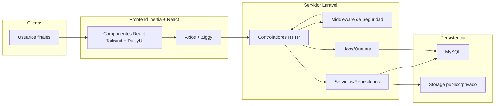
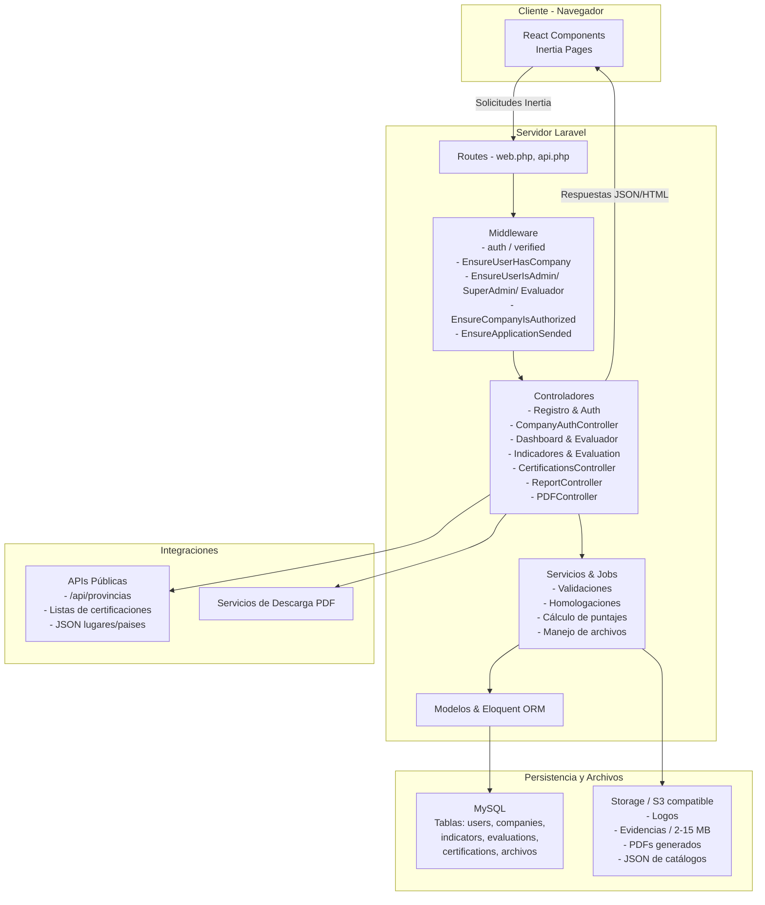

# Documentación plataforma de Licenciamiento esencial Costa Rica

Documento maestro con toda la información técnica, funcional, operativa y de seguridad necesaria para el expediente institucional requerido por el departamento de TI. Integra el contenido completo anteriormente distribuido en múltiples dossiers y elimina la necesidad de consultar referencias externas.

Link al [Repositorio de GitHub](https://github.com/buzzcostarica/licenciamiento)

## 1. Resumen Ejecutivo y Propósito
- **Objetivo del sistema:** Digitalizar el proceso de licenciamiento Marca País para empresas exportadoras, abarcando registro, asociación de empresas, autoevaluación, evaluación formal, gestión de certificaciones y emisión de reportes oficiales.
- **Actores principales:** Usuarios solicitantes, administradores de empresa, evaluadores, super administradores y personal de TI.
- **Propósito del expediente:** Describir tecnologías, arquitectura, módulos funcionales, procesos detallados, manuales de instalación/operación/mantenimiento y controles de seguridad exigidos por los estándares institucionales.

## 2. Tecnologías, Entorno y Dependencias
| Capa | Tecnologías y paquetes | Uso principal |
| --- | --- | --- |
| Backend | PHP 8.2, Laravel 11, Sanctum, Breeze, Filament, Inertia Laravel, Barryvdh DOMPDF, PHPWord, Maatwebsite Excel, FPDF/FPDI | API REST + SSR, autenticación basada en tokens/sesiones, panel administrativo Filament, generación de PDFs/Word/Excel, exportación documental |
| Frontend | React 18, Inertia.js, Vite 5, Tailwind CSS 3, DaisyUI, HeadlessUI, Axios, Heroicons, Lucide, React Datepicker | SPA híbrida conectada al router de Laravel, componentes responsivos, formularios complejos, drag & drop para indicadores, comunicación protegida con Laravel |
| Datos | MySQL (importación inicial `db_limpia.sql`), archivos JSON (`lugares.json`, `paises.json`), repositorio documental en `storage/app/public/pdfs` | Persistencia transaccional |
| Environment | Composer, npm, Vite, Artisan (`serve`, `migrate`, `queue`, `optimize`), `concurrently` | Instalación, build, ejecución paralela de servidor Laravel, colas, pail logs y compilación Vite en desarrollo |

### Requerimientos de infraestructura
1. Servidor con PHP 8.2+, extensiones habilitadas para Laravel 11 y Composer actualizado.
2. Entorno Node.js 18+ (recomendado) para ejecutar y construir el frontend con Vite.
3. Motor MySQL configurado (`db_limpia.sql`) y las migraciones vigentes.
4. Variables en `.env` (APP_KEY, credenciales de DB, drivers de mail y colas, claves de almacenamiento y servicios externos).
5. Acceso a almacenamiento local para enlazar `storage/app/public`, alojar JSON y PDFs.
6. Enlace de almacenamiento `php artisan storage:link`, espacio para JSON de ubicaciones geograficas y repositorio de PDFs institucionales.

## 3. Arquitectura Técnica y Diagrama


## Diagrama (Mermaid)


### Descripción técnica
1. **Front-end Inertia** renderiza vistas dinámicas (dashboard, formularios, paneles) manteniendo los beneficios de Laravel SSR; Ziggy proporciona rutas firmadas y Axios gestiona solicitudes protegidas por Sanctum/CSRF.
2. **Back-end Laravel** organiza el dominio mediante controladores definidos en `routes/web.php` (`CompanyAuthController`, `DashboardController`, `IndicadoresController`, `EvaluationController`, `CertificationController`, `SuperAdminController`, etc.) que orquestan módulos de autenticación, certificaciones, autoevaluaciones, evaluaciones, reportes, cada uno detrás de middleware de rol y estado empresarial. Servicios y colas manejan tareas pesadas como generación de reportes.
3. **Seguridad por middleware**: `auth`, `verified`, `EnsureUserHasCompany`, `EnsureCompanyIsAuthorized`, `EnsureApplicationSended`, `EnsureUserIsSuperAdmin`, `EnsureUserIsEvaluador` y variantes específicas controlan rol, estado de empresa y pasos previos antes de liberar vistas o APIs. Rutas agrupadas aseguran que cada módulo herede autenticación, verificación de email y asociación de empresa.
4. **Persistencia y archivos**: MySQL almacena usuarios, empresas, indicadores, certificaciones y evidencias en tablas transaccionales; `storage/app/public` resguarda logos, fotografías, PDFs, Word y Excel generados. Los paquetes DOMPDF/FPDI/PHPWord generan expedientes descargables.

## 4. Módulos Funcionales y Rutas Principales
| Módulo | Rutas principales | Resumen operativo |
| --- | --- | --- |
| Registro y asociación de empresa | `POST /register`, `POST /company-register`, `/company-register`, verificación de cédula jurídica, `CompanyAuthController` | Captura datos personales, valida formatos, verifica unicidad de email/cédula y asigna administrador inicial. Los usuarios completan datos personales, verifican la cédula jurídica, registran empresas inexistentes o solicitan acceso a empresas registradas. El sistema valida formatos, unicidad, y asigna al solicitante como administrador al crear la empresa. Gestiona solicitudes de acceso a empresas existentes y flujos de aprobación/rechazo |
| Formulario empresarial | `GET/POST /company/profile` y endpoints de carga `upload-logo/fotos/certificaciones` | Administra información corporativa, contactos obligatorios/opcionales, multimedia y datos de exportación con guardado parcial |
| Dashboard y Autoevaluación | `/dashboard`, `GET /indicadores/{id}`, `POST /indicadores/store-answers`, `POST /indicadores/finalizar-autoevaluacion`, `DashboardController`, `IndicadoresController` | Presenta el progreso de cumplimiento y cuestionarios. Los indicadores permiten guardar respuestas parciales, finalizar autoevaluaciones y verificar estado antes de enviar la solicitud formal. Presenta indicadores por valores, soporta homologaciones, guardado automático y bloqueo tras finalización |
| Evaluación formal | `GET /evaluacion/{value_id}`, `POST /evaluacion/store-answers`, `POST /evaluacion/enviar-evaluacion-calificada`, `EvaluationController` | Solo accesible si la empresa completó la autoevaluación y está autorizada; procesa envíos finales y manejo de archivos adjuntos para cada indicador. Desglosa preguntas derivadas de indicadores aprobados, maneja evidencias y calificaciones de evaluadores |
| Gestión de certificaciones | `GET /certifications/create`, `POST /certifications`, `PUT/DELETE /certifications/{id}` | Permite crear, editar y eliminar certificaciones homologables con restricciones de archivos y vigencias |
| Paneles administrativos | `/dashboard`, `/evaluador/*`, `/super/*`, `EvaluadorController`, `SuperAdminController` y controladores auxiliares, APIs asociadas | Ofrecen visión de progreso, asignación de empresas, administración de valores, subcategorías, requisitos, usuarios, empresas, certificaciones, importaciones y fechas de expiración mediante vistas específicas y APIs REST internas. Gestiona empresas asignadas, reportes y reevaluaciones, incluyendo cambiar de empresa activa y actualizar campos de evaluación |
| Reportes y Documentos | Controladores `ReportController`, `PDFController`, `MonthlyReportController` | Generación de reportes gerenciales, actas en PDF y listados mensuales apoyados en bibliotecas DOMPDF, Excel y Word. Generan expedientes PDF, Word y Excel para Dirección de TI y seguimiento operativo |

## 5. Requerimientos Funcionales Clave
1. **Gestión de Registro**: Validaciones estrictas en registro (nombres, apellidos, emails, contraseñas, aceptación de términos) y asociación de empresas mediante cédula jurídica (solo números, máximo 12 dígitos). Validaciones estrictas de campos de usuario y empresa, verificación de cédula jurídica y manejo de solicitudes pendientes.
2. **Flujo condicional según existencia de empresa**: Solicitud de acceso con notificaciones al administrador o creación completa de empresa con asignación automática de administrador y fecha de autoevaluación.
3. **Flujo de Autoevaluación → Evaluación**: Guardado parcial y finalización del formulario empresarial, bloqueo tras enviar autoevaluación y controles para reabrir solo bajo autorización. Guardado parcial, envío final y verificación de `application_sended` antes de permitir formularios empresariales, evitando envíos duplicados una vez evaluados.
4. **Autoevaluación con homologaciones**: Homologaciones automáticas derivadas de certificaciones vigentes, indicadores descalificatorios señalados y cálculo de puntaje consolidado.
5. **Evaluación formal**: Verificación de requisitos previos, flujos de evidencias (1-3 archivos, ≤2 MB c/u, 15 MB por pregunta) y calificación con estados transicionales auditables.
6. **Roles y permisos**: Cuatro roles (super_admin, admin, user, evaluador) definen qué vistas y APIs se muestran; el README resume las responsabilidades requeridas por el negocio.
7. **Gestión documental segura**: Subida de logos, fotos y certificaciones bajo límites de formato (JPG/PNG/PDF/DOC/DOCX/XLS/XLSX) y tamaño.
8. **Reportes**: Emisión de reportes mensuales automático mediante comando con cron jobs. Descarga manual de reportes por empresa. Emisión de reporte de evaluación.
9. **Notificaciones y comunicación**: Envío automático de confirmaciones de registro, solicitudes, finalizaciones de autoevaluación, evaluaciones completadas, calificaciones emitidas, avisos de solicitud y flujos de aprobación.

## 6. Seguridad, Controles y Protección
1. **Autenticación y sesiones:** Laravel Breeze/Sanctum brindan autenticación basada en sesiones/SPA con protección CSRF, revocación de tokens y hashing seguro (`bcrypt/argon`). Se configuran expiraciones, limpieza de sesiones inactivas y recuperación de contraseñas verificando correo electrónico.
2. **Control de acceso y roles:** Middlewares (`auth`, `verified`, `EnsureUserHasCompany`, `EnsureCompanyIsAuthorized`, `EnsureApplicationSended`, `EnsureUserIsSuperAdmin`, `EnsureUserIsEvaluador`) aplican restricciones por rol, estado de empresa y pasos previos. Super administradores gestionan componentes y usuarios; evaluadores solo ven empresas asignadas; administradores corporativos editan datos antes de la evaluación; usuarios regulares consultan su progreso.
3. **Validación e integridad de datos:** Formularios aplican sanitización, validaciones de formato/longitud/fecha y restricciones de archivos para impedir datos inconsistentes o inyecciones. Los procesos críticos utilizan transacciones y rollback ante errores.
4. **Protección de flujos críticos:** El acceso al formulario empresarial depende del envío de autoevaluación y de la autorización del estado empresarial; las evaluaciones no pueden calificarse sin cumplir requisitos previos. Certificaciones duplicadas y reprocesos no autorizados se bloquean automáticamente.
5. **Gestión documental y respaldo:** Archivos se almacenan en `storage/app/public` mediante `php artisan storage:link`, con permisos restringidos, compresión y firma de URLs cuando se exponen externamente. Se mantienen políticas de respaldo para la base de datos, JSON de ubicaciones geograficas y almacenamiento de expedientes.
6. **Auditoría, trazabilidad y monitoreo:** Laravel Pail y los logs nativos registran eventos, cambios de estado y errores. Notificaciones automáticas documentan aprobaciones, rechazos y reevaluaciones, aportando evidencia para el departamento de TI.

## 7. Manuales Operativos
### 7.1 Instalación y configuración
1. Clonar el repositorio y ejecutar `composer install` y `npm install`.
2. Configurar `.env`, generar `APP_KEY`, definir credenciales de base de datos, correos y servicios externos.
3. Importar la base inicial (`db_limpia.sql`) y ejecutar las migraciones vigentes.
4. Limpiar cachés, crear el enlace de almacenamiento (`php artisan storage:link`) y poblar JSON de ubicaciones geograficas y PDFs requeridos en `storage/app/public/pdfs`.
5. Levantar servidores de desarrollo (`php artisan serve`, `npm run dev`) o construir para producción (`npm run build`, `php artisan optimize`).

#### 7.1.1 Guía detallada de instalación
**Requisitos previos**
- PHP 8.2 +.
- MySQL
- Node.js (para `npm install`/`npm run dev`) y Composer.

**Instalación de dependencias**
```
npm install
composer install
```

**Configuración del entorno**
- Crear `.env` a partir de `.env.example`.
- Configurar variables (DB, mail, storage, claves externas).
- Generar clave de la aplicación:
```
php artisan key:generate
```

**Base de datos**
- Crear la base en MySQL.
- Importar `db_limpia.sql`.
- Ejecutar migraciones:
```
php artisan migrate
```

**Configuraciones adicionales**
```
php artisan optimize:clear
php artisan storage:link
```
- Copiar `lugares.json` y `paises.json` a `storage/app/public`.

**Ejecución en desarrollo**
```
php artisan serve
npm run dev
```

**Despliegue**
```
npm run build
php artisan optimize:clear
php artisan optimize
```

### 7.2 Despliegue y mantenimiento
- Construir assets con `npm run build`.
- Comprimir los archivos en .zip y luego cargarlos dentro de public_html del servidor.
> **⚠️ Importante:** No subir ni sobrescribir el archivo `.env` del servidor durante la carga; si lo haces, se sobreescribe la configuración de variables sensibles que ya estén definidas en producción.
- Descomprimir el .zip
- Abrir terminal y ejecutar comandos.
- Ejecutar `php artisan optimize:clear` para limpiar caches, y luego `php artisan optimize` para configurar todas las caches de vistas, rutas, etc
- Revisar logs (`storage/logs`, Laravel Pail) y limpiar archivos temporales.

### 7.3 Operación diaria
1. **Autenticación**: Iniciar sesión con el super administrador inicial (`admin@admin.com` / `password`) y actualizar las credenciales inmediatamente en ambientes reales.
2. **Gestión de Roles**: Utilizar el panel `/super/users` para asignar roles y estados siguiendo la tabla descrita en el README. Gestionar roles y permisos desde el panel de super administración (usuarios, empresas, indicadores, valores, certificaciones).
3. **Registro de Empresas**: Seguir el flujo documentado en `docs/registro.md` para onboarding de nuevas organizaciones y verificación de cédulas.
4. **Autoevaluación y Evaluación**: Supervisar dashboards, habilitar formularios de empresa sólo cuando `application_sended`=1 y la empresa esté autorizada. Evaluadores acceden a `/evaluador/dashboard` para revisar empresas asignadas, responder reevaluaciones, calificar y, si es necesario, solicitar recalificaciones mediante `/api/evaluacion/calificar-nuevamente`.
5. **Reportes y Documentos**: Generar reportes desde `/super/reportes` y respaldar archivos producidos por DOMPDF/Excel para el expediente institucional. Exportar reportes PDF/Word/Excel oficiales desde los paneles administrativos, archivándolos según las políticas de TI.

## 8. Detalle de Procesos Clave
### 8.1 Registro de usuario y empresa
#### Formulario de registro
- Campos: nombre y apellido (solo letras/espacios), email válido, contraseña ≥8 caracteres y aceptación de términos.
- Validaciones: formato correcto, email único, robustez de contraseña y confirmación de términos.

#### Post-registro
- Creación de usuario en base, envío de notificación de bienvenida, autenticación automática y redirección a la verificación de cédula jurídica.

#### Verificación de cédula jurídica
- Entrada numérica (solo dígitos, máximo 12) validada en servidor.
- Resultados:
  - **Empresa existe:** se muestra información básica y se habilita solicitud de acceso o regreso.
  - **Empresa no existe:** se redirige al formulario de registro de empresa.

#### Flujo cuando la empresa existe
- El usuario puede solicitar acceso. El sistema notifica al administrador actual, marca al solicitante como pendiente y espera aprobación/rechazo.
- Estados se actualizan automáticamente y se registran para auditoría.

#### Flujo cuando la empresa no existe
- Formulario con campos obligatorios (nombre comercial, sitio web, sector, provincia, actividad, teléfonos, confirmación de exportadora, etc.).
- Validaciones por tipo de dato (URL, teléfonos numéricos, selección de sector/provincia).
- Resultado: creación de empresa, asignación de rol administrador al solicitante, establecimiento de fecha de inicio de autoevaluación y redirección al dashboard.

#### Notificaciones y seguridad del registro
- Correos de bienvenida, solicitudes de acceso, avisos al administrador y confirmaciones de aprobación/rechazo.
- Sanitización de inputs, validación de roles, limpieza de sesiones y middleware de autenticación protegen el flujo.

### 8.2 Formulario empresarial
#### Funciones principales
- **Manejo de estado y datos:** `handleChange`, `handleURLChange`, `handleAnioFundacionChange`, `handlePaisesChange`.
- **Validaciones:** `validarCampo`, `isValidEmail`, `obtenerLimitesEmpleados` para rangos de personal.
- **Imágenes:** `handleImagenChange`, `uploadLogo`, `uploadFotografias`, `uploadCertificaciones`, `removeImagen`, `removeExistingImage`.
- **Productos:** `agregarProducto`, `handleDeleteProducto`, `eliminarProductoNuevo`, `confirmarEliminarProducto`.
- **UI/Navegación:** `toggleSeccion`, `pasarSiguienteSeccion`, `openFinalizarModal`, `confirmFinalizarAutoevaluacion`.

#### Campos requeridos
1. **Información general:** nombre comercial y legal, descripciones ES/EN, año de fundación (DD/MM/AAAA), sitio web, tamaño, cédula jurídica, actividad comercial.
2. **Imágenes y multimedia:** logo (≤1 MB JPG/PNG), fotografías (1-3, ≤3 MB c/u), certificaciones opcionales (≤1 MB c/u).
3. **Información de licenciamiento:** razones ES/EN, proceso y recomendación de Marca País.
4. **Contactos obligatorios:** notificaciones, proceso de licenciamiento y representante legal (nombre completo, email, puesto, teléfono, celular y cédula donde aplique).
5. **Contactos opcionales:** mercadeo, micrositio y vocero con los mismos campos.
6. **Empresas exportadoras:** países de exportación, productos o servicios, rango de exportaciones y planes de expansión.

#### Reglas y restricciones
- Campos obligatorios marcados con *.
- Validaciones específicas para emails, teléfonos numéricos y fechas.
- Capacidad de guardado parcial y bloqueo tras finalizar autoevaluación.
- Edición posterior solo mediante intervención de evaluadores o super administradores.

### 8.3 Proceso de autoevaluación
#### Inicio
- Registro de fecha de inicio para congelar el conjunto de indicadores; nuevos indicadores no afectan evaluaciones en curso.
- Verificación de certificaciones vigentes y homologación automática (respuestas "Sí" no editables mientras la certificación esté activa).

#### Evaluación de indicadores
- Visualización agrupada por valores, mostrando homologaciones y marcadores de indicadores descalificatorios.
- Respuestas binarias (Sí/No) con justificación obligatoria para "Sí".
- Guardado automático y bloqueo de edición para homologados.

#### Indicadores descalificatorios
- Etiquetas visibles; cualquier "No" descalifica pero permite completar el resto para expediente.

#### Cálculo de puntaje
```
Puntaje = (Respuestas "Sí" + Indicadores Homologados) / Total de Indicadores * 100
```
- Requisitos: nota mínima por valor, todos los descalificatorios en "Sí" y homologaciones contadas como "Sí".

#### Formulario adicional y documentación
- Información general, contactos, operaciones y anexos (logo, fotos, certificaciones, catálogo de productos de la empresa) deben estar completos para finalizar.

#### Finalización del proceso
1. Verificación de completitud.
2. Cálculo del puntaje final.
3. Generación de reporte PDF.
4. Envío de notificaciones.
5. Bloqueo de edición.

#### Homologaciones
- Flujo: carga de certificaciones → verificación de vigencia → identificación de indicadores homologables → asignación automática de respuestas y justificaciones.
- Reversión automática cuando vence la certificación.

#### Rutas y seguridad
- Visualización: `GET /indicadores/{id}`.
- Respuestas: `POST /indicadores/store-answers`, `POST /indicadores/save-partial-answers`.
- Finalización: `POST /indicadores/finalizar-autoevaluacion`.
- Formularios adicionales y cargas: `POST /company/profile` y variantes `upload-{tipo}`.
- Seguridad basada en autenticación, verificación de pertenencia a empresa, control de edición y validaciones de formatos/fechas/archivos.
- Notificaciones por guardado automático, certificaciones próximas a vencer, finalización y aprobaciones/rechazos.

### 8.4 Proceso de evaluación
#### Requisitos previos
- Autoevaluación completada, indicadores respondidos con "Sí", formulario empresarial completo y empresa exportadora o autorizada.

#### Filtrado y visualización
- Solo se muestran preguntas derivadas de indicadores aprobados y homologados en la fecha de registro, con soporte para homologaciones automáticas.

#### Tipos de preguntas y requisitos
- Preguntas binarias, descriptivas y homologadas.
- Cada pregunta requiere respuesta, descripción detallada, evidencias (1-3 archivos; formatos jpg/jpeg/png/pdf/doc/docx/xls/xlsx; ≤2 MB por archivo; ≤15 MB totales) y justificación cuando aplique.
- Evidencias se comprimen y almacenan de forma segura.

#### Homologaciones
- Identificación automática de certificaciones válidas, mapeo de indicadores, asignación de respuestas y reutilización de evidencias; edición bloqueada mientras la certificación siga vigente.

#### Calificación por evaluador
- Pasos: revisión, verificación de evidencias, calificación (Aprobado/No aprobado) y comentarios.
- Criterios: pertinencia, calidad, cumplimiento y validez de homologaciones.

#### Cálculo de puntaje
```
Puntaje = (Preguntas Aprobadas / Total de Preguntas a Responder) * 100
```
- Solo se consideran preguntas calificadas; homologaciones cuentan como aprobadas; indicadores vinculantes son críticos.

#### Estados del proceso
1. `evaluacion` (inicial)
2. `evaluacion-pendiente` (completada por la empresa)
3. `evaluacion-completada` (enviada al evaluador)
4. `evaluado` (en revisión)
5. `evaluacion-calificada` (aprobada)
6. `evaluacion-desaprobada` (rechazada)
- Transiciones automáticas o manuales generan notificaciones para empresa, evaluador y super administración.

#### Roles y responsabilidades
- **Empresa:** responde preguntas, sube evidencias, envía la evaluación y consulta calificaciones; no puede editar tras el envío ni aprobarse a sí misma.
- **Evaluador:** revisa respuestas, califica preguntas, agrega comentarios, verifica evidencias, valida homologaciones, justifica rechazos y genera reportes.

#### Rutas del sistema
- Visualización: `GET /evaluacion/{value_id}`, `GET /api/evaluation/indicators`.
- Respuestas: `POST /evaluacion/store-answers`, `POST /evaluacion/store-answers-by-indicator`.
- Calificación y reevaluación: `POST /evaluacion/calificar-nuevamente`, `POST /evaluacion/enviar-evaluacion-calificada`.
- Panel evaluador: `GET /evaluador/dashboard`, `GET /evaluador/evaluations`, `POST /api/evaluador/switch-company`.

#### Seguridad y validaciones
- Control de archivos (tipos, tamaños, compresión, almacenamiento seguro).
- Verificación de roles, control de estados, registro de acciones y trazabilidad completa.
- Sanitización de inputs, validación de formatos y respaldos automáticos de respuestas/evidencias.

#### Reportes y notificaciones
- PDF con resumen ejecutivo, detalle por valor, evidencias y calificaciones.
- Estadísticas de progreso, puntajes, indicadores críticos y homologaciones.
- Notificaciones por evaluación completada, calificación, aprobación/rechazo y cambios de estado.

### 8.5 Gestión de certificaciones (contenido completo)
#### Rutas
- Visualización: `GET /certifications/create` (lista existente + formulario), protegido con `auth`, `verified`, `EnsureUserHasCompany`.
- Creación: `POST /certifications` con las mismas protecciones.
- Actualización: `PUT /certifications/{certification}`.
- Eliminación: `DELETE /certifications/{certification}`.

#### Proceso de creación
1. Selección de certificación homologable; se evita duplicidad.
2. Registro de fechas: obtención (≤ fecha actual) y expiración (> obtención).
3. Captura del organismo certificador (obligatorio, solo letras y números).
4. Gestión de archivos: máximo 3, 5 MB por archivo, 15 MB totales, formatos jpg/jpeg/png/pdf/doc/docx/xls/xlsx; permite arrastrar y soltar, selección manual, vista previa y eliminación individual.
5. Validaciones: campos obligatorios completos, coherencia de fechas, formatos y tamaños correctos, al menos un archivo y ausencia de duplicados.
6. Procesamiento: validación del formulario, compresión de imágenes, almacenamiento de archivos, registro en base, cálculo de indicadores homologados y respuesta al usuario.

#### Gestión de certificaciones existentes
- Lista ordenada con información detallada, estado de expiración y archivos adjuntos.
- Edición de fechas, organismo y archivos (agregar/eliminar con límites vigentes, visualizar existentes).
- Eliminación mediante modal de confirmación que borra registros y archivos asociados.

#### Manejo de errores y seguridad
- Validación en tiempo real, mensajes específicos, rollback y limpieza de archivos ante fallos.
- Registro de errores en logs.
- Autenticación obligatoria, verificación de email, pertenencia a empresa, sanitización de inputs y protección contra desbordamientos de archivos.

## 9. Expediente y Referencias Cruzadas
| Documento | Contenido | Ubicación |
| --- | --- | --- |
| `README.md` | Guías de instalación, despliegue, roles y rutas esenciales. | Raíz del repositorio. |
| `docs/registro.md` | Detalle del flujo de registro, validaciones, seguridad y notificaciones. | `docs/` |
| `db_limpia.sql` | Estructura inicial de base de datos y datos semilla para licenciamiento. | Raíz. |
| `lugares.json` / `paises.json` | JSON de ubicaciones geograficas, requeridos para formularios y reportes. | Raíz (copiar a storage). |
| `storage/app/public/pdfs` | Plantillas institucionales (anexos, formatos oficiales). | Directorio de almacenamiento. |
| `composer.json` | Definición de dependencias PHP y scripts de desarrollo. | Raíz. |
| `package.json` | Definición de dependencias Node.js y scripts de build. | Raíz. |
| `routes/web.php` | Definición de rutas y agrupación de middleware. | `routes/` |
| `app/Http/Middleware/` | Middleware de seguridad y control de acceso. | `app/Http/Middleware/` |